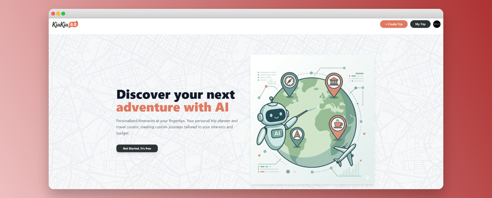

# [KiaKia] 🚀

> A lightweight AI-powered travel planning app that helps users instantly generate personalized trip itineraries based on their preferences and destinations

---

## 💡 About The Project
This project was built to demonstrate how AI can be leveraged to solve real-world user problems through a clean and scalable front-end architecture. The goal was to deliver a fast, intuitive, and production-ready experience that goes beyond a simple demo.

*   **Problem:** 
    Travel planning is often slow, fragmented, and overwhelming—users need to manually research destinations, organize itineraries, and juggle multiple tools.
*   **Solution:**  Kiakia uses AI to instantly generate personalized travel plans, turning a multi-step, time-consuming process into a seamless, one-click experience.
*   **Motivation:** I built this project to showcase my ability to ship real-world products by combining modern front-end development with AI integration, focusing on performance, usability, and practical impact.

## 🛠️ Built With & Key Tech
This project demonstrates my proficiency in:

*   **Frontend:** React (Vite), React Router, Tailwind CSS
*   **Backend/API:**  Firebase
*   **Database:**  Firestore
*   **State Management:**  Zustand (lightweight global state for managing form data, auth flow, and UI state)
*   **AI Integration:**   Google Generative AI API (prompt engineering & response handling)
*   **UX & Logic Handling:**   UX & Logic Handling: Async state management, form persistence, protected routes, request lifecycle handling (loading, cancel, error)
*   **Tools:**   Git, GitHub, Vercel (deployment), environment configuration

## 🚀 Key Features
*   **AI Trip Generator:**  Instantly generates personalized travel itineraries using AI based on user preferences, making trip planning significantly faster and more efficient.
*   **Persistent Form State with Zustand:**  User inputs are preserved across navigation and even during authentication flows, ensuring no data is lost and delivering a seamless user experience.
*   **Seamless Auth Flow & Routing:** Users can start creating a trip before logging in, and after authentication, are redirected back with their progress fully intact.

